# Front-end JS engineer test assessment - the React component library

## Project Setup

Go to app folder

```bash
  cd my-vite-app
```

Install all project dependencies

```bash
  npm install
```

Start the React development server

```bash
  npm run dev
```

Start Storybook in development mode

```bash
  npm run storybook
```

## Components

### Input

Password Clearable
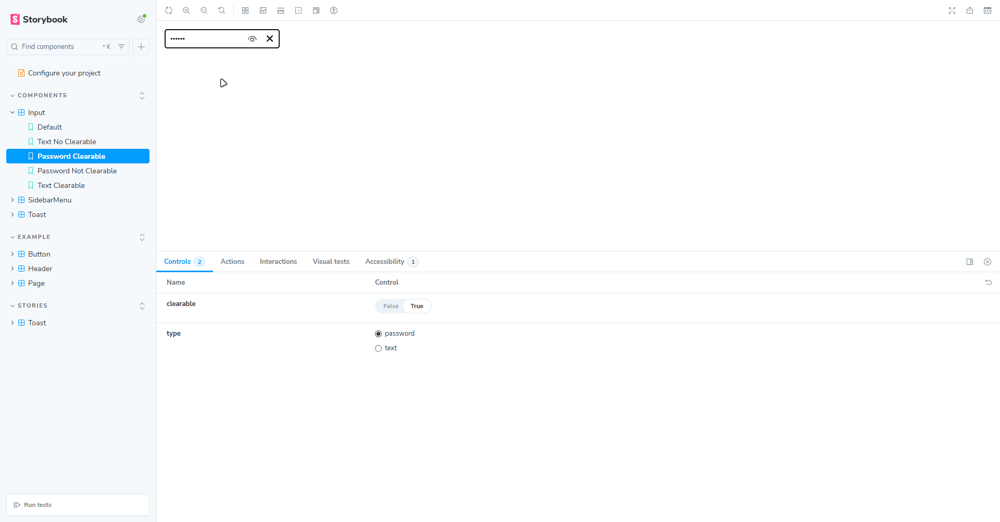

Password Not Clearable
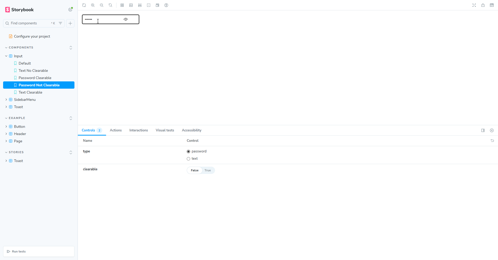
Text Clearable
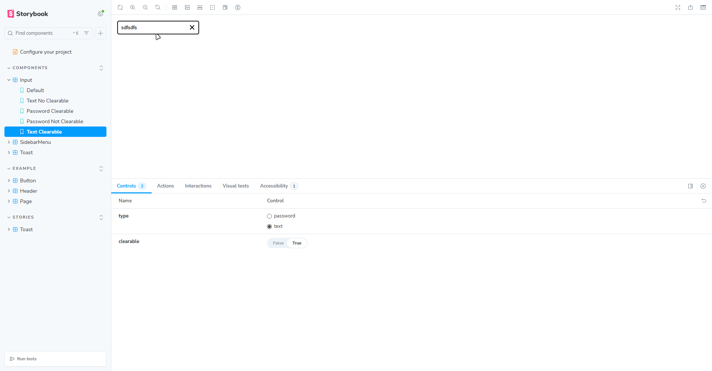
Text Not Clearable
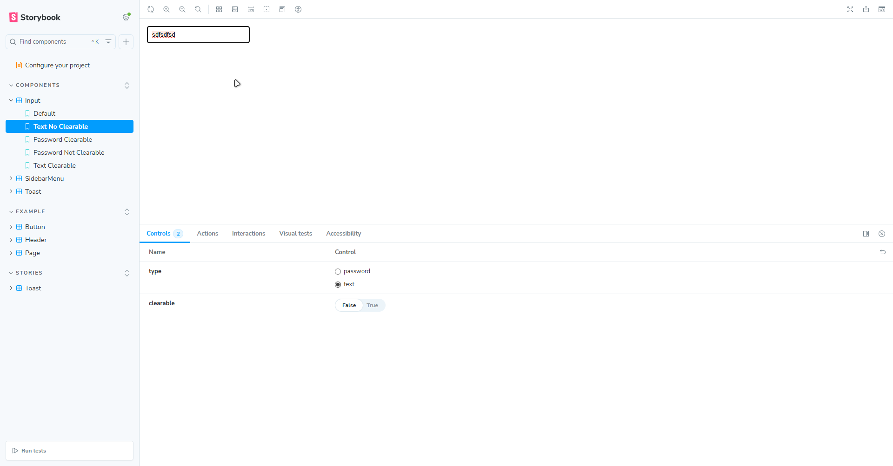

### Toast

Info
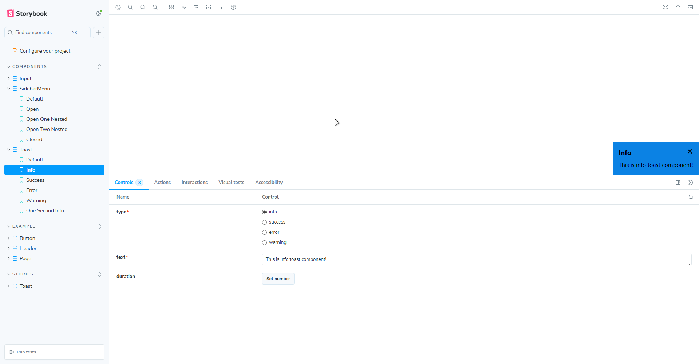
Success
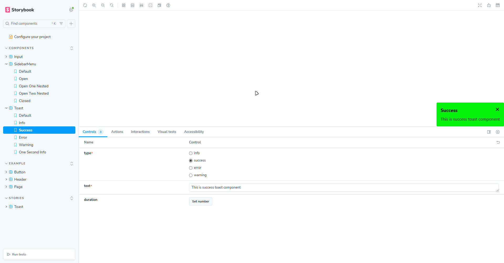
Warning
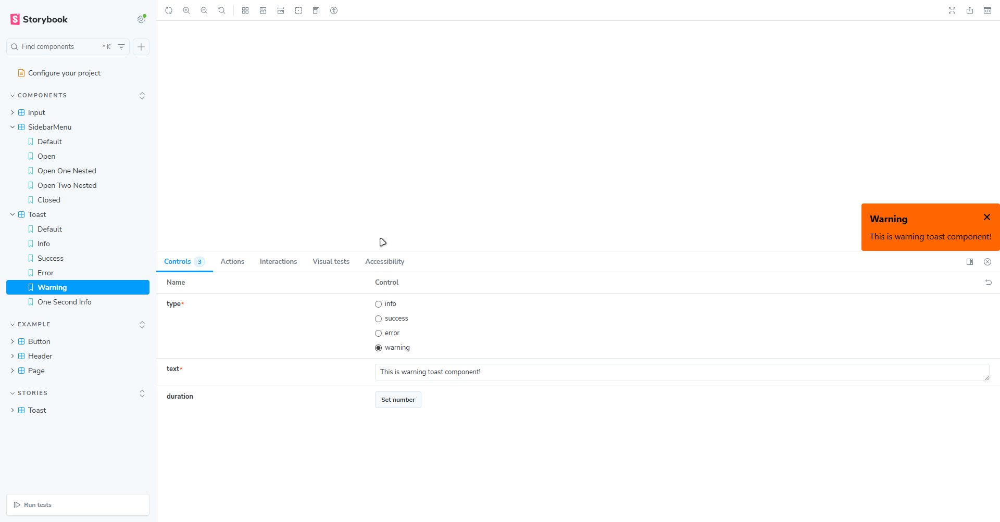
Error
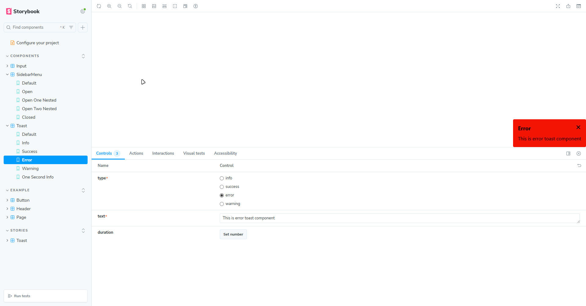

### Sidebar Menu

Open no text
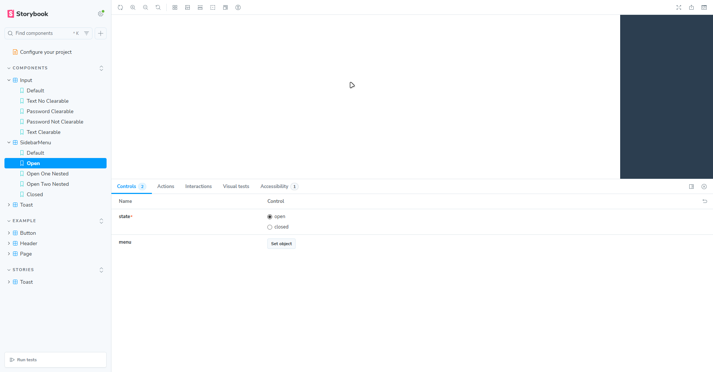

Open 1 nested item
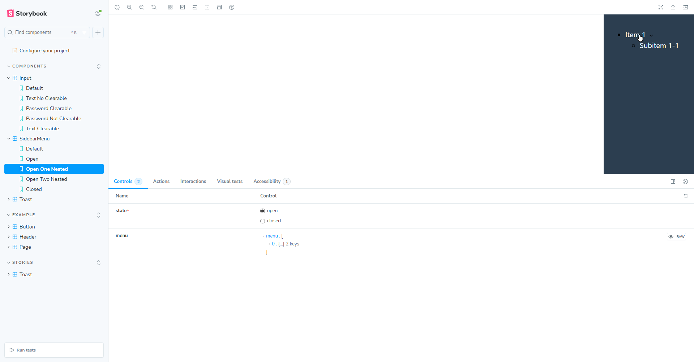

Open 2 nested item
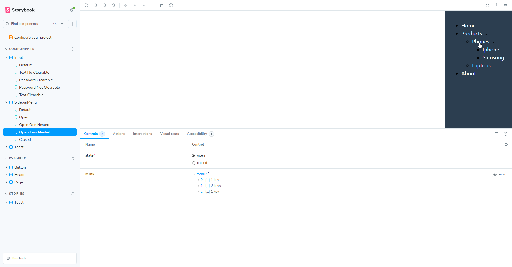

Open no text
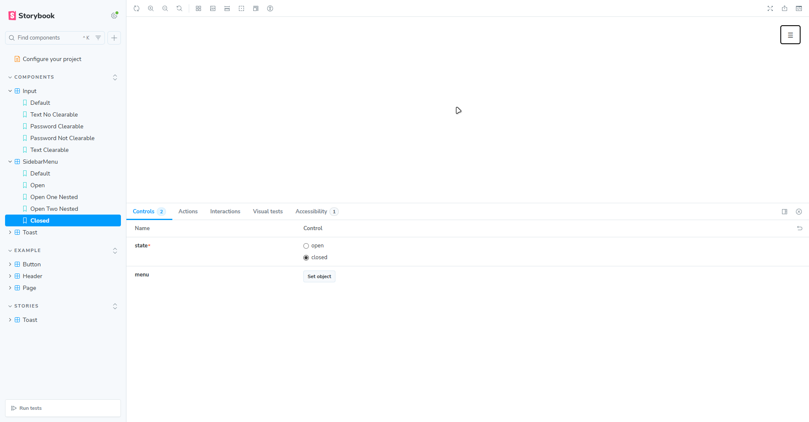
